# Mermaid 代码生成图表

## 流程图 (Flowchart)

### 基础语法

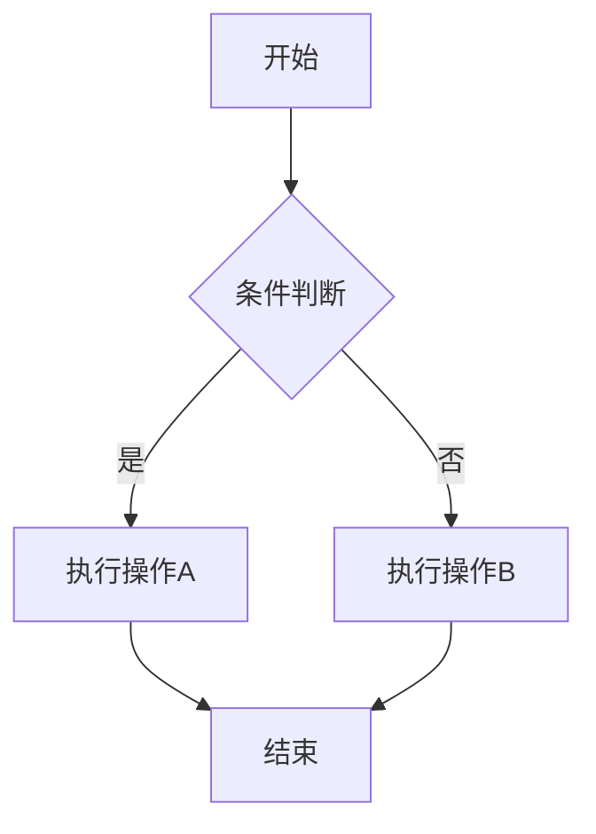

### 节点形状

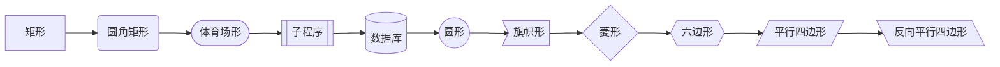

### 子图分组

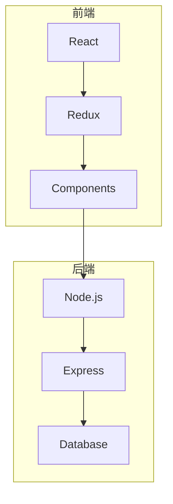

### 方向控制

```
TB - 从上到下 (Top to Bottom)
TD - 从上到下 (Top Down)
BT - 从下到上 (Bottom to Top)
RL - 从右到左 (Right to Left)
LR - 从左到右 (Left to Right)
```

## 时序图 (Sequence Diagram)

### 基础交互

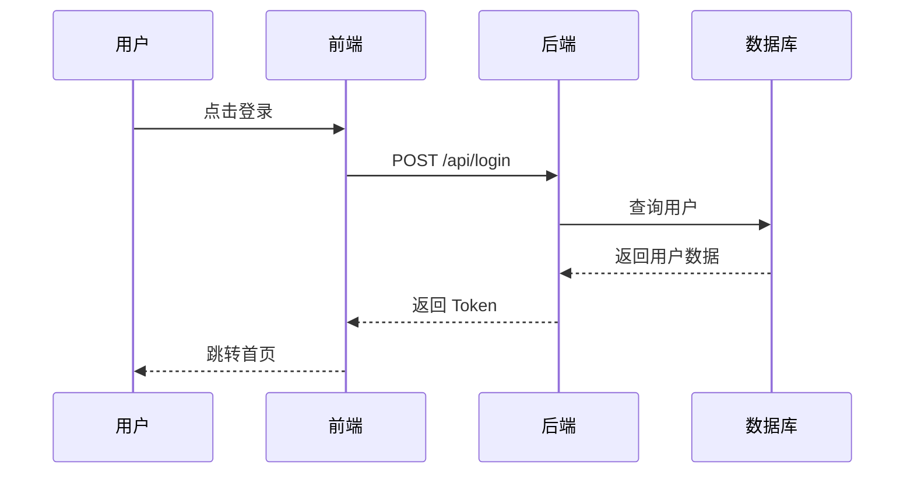

### 高级特性

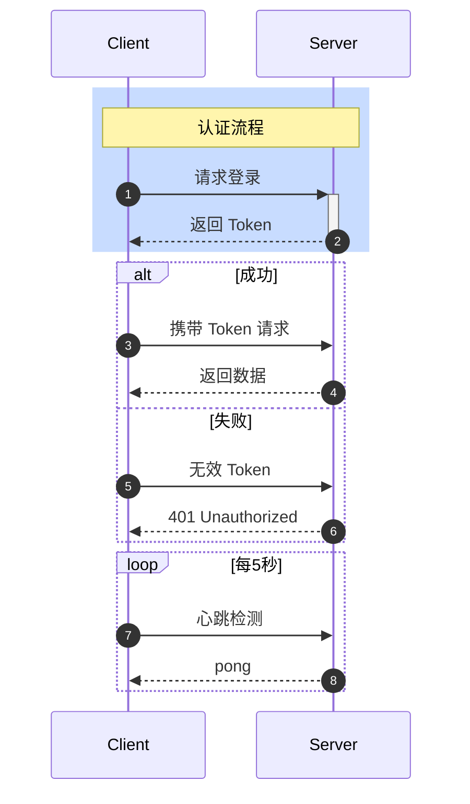

### 消息类型

```
->   实线箭头
-->  虚线箭头
->>  实线带箭头
-->> 虚线带箭头
-x   实线带叉
--x  虚线带叉
-)   实线带开放箭头
--)  虚线带开放箭头
```

## 类图 (Class Diagram)

### 类定义

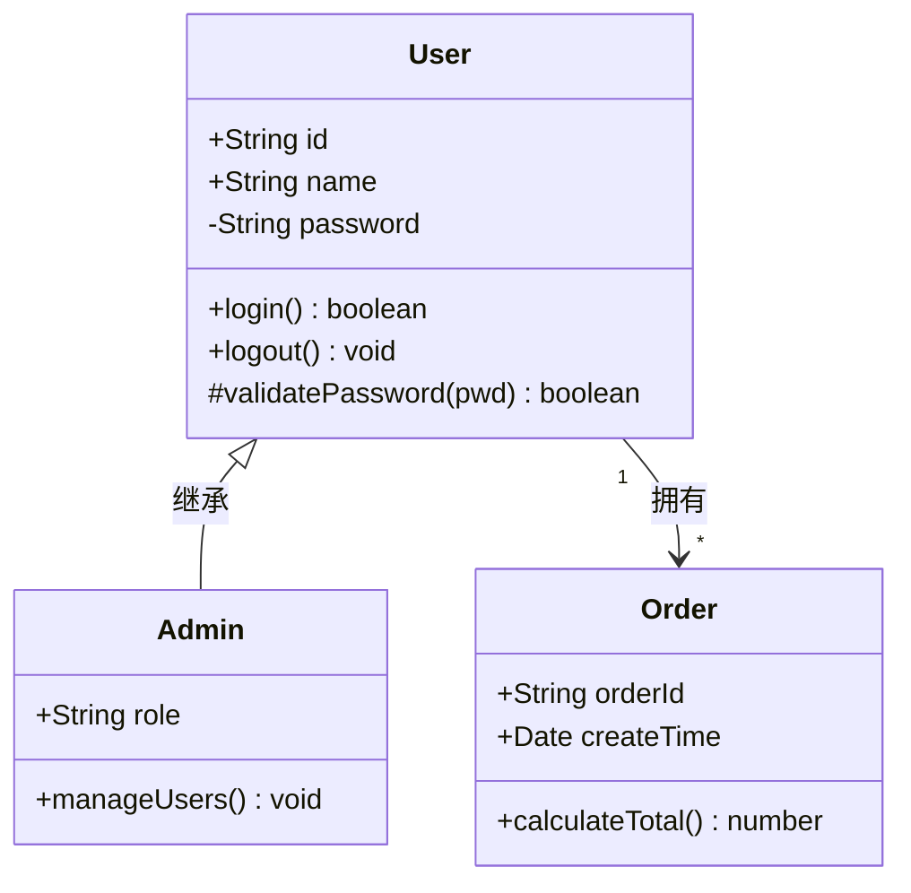

### 关系类型

```
<|-- 继承
*--  组合
o--  聚合
-->  关联
--   链接
..>  依赖
..|> 实现
```

## 状态图 (State Diagram)

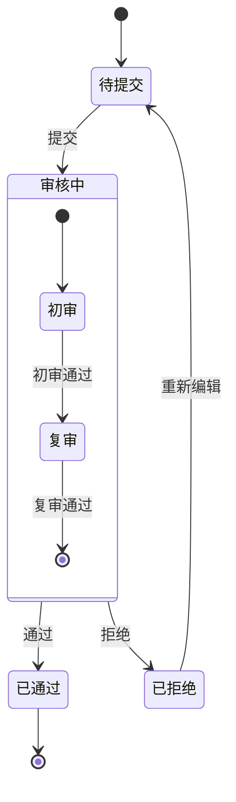

## ER 图 (Entity Relationship)

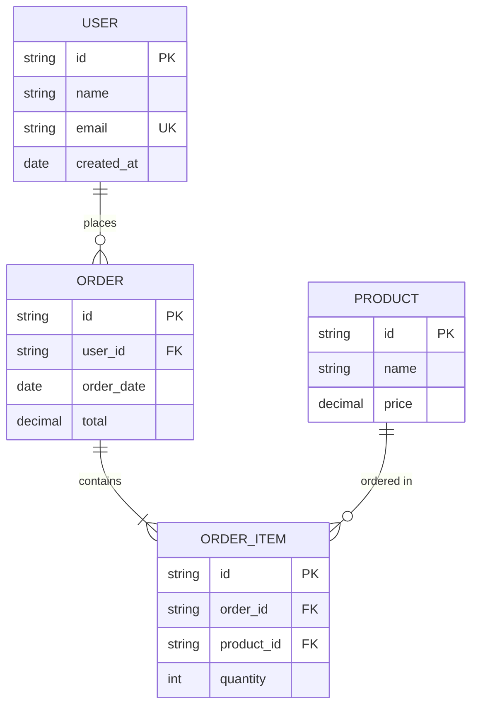

## 甘特图 (Gantt)

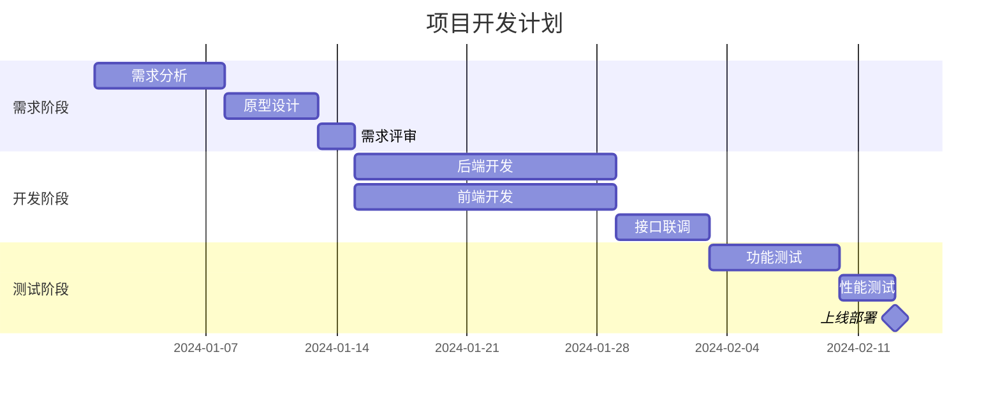

## 饼图 (Pie Chart)

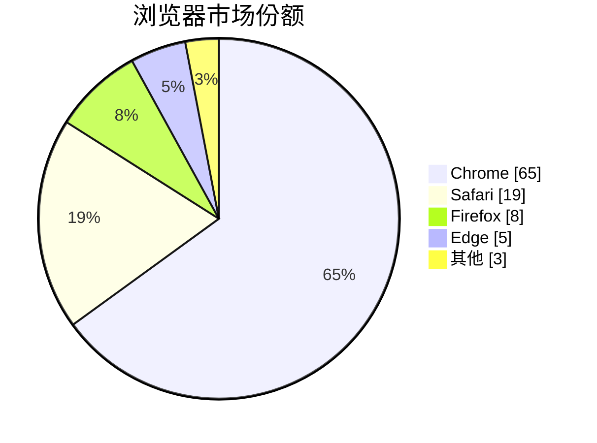

## 架构图模板

### 微服务架构

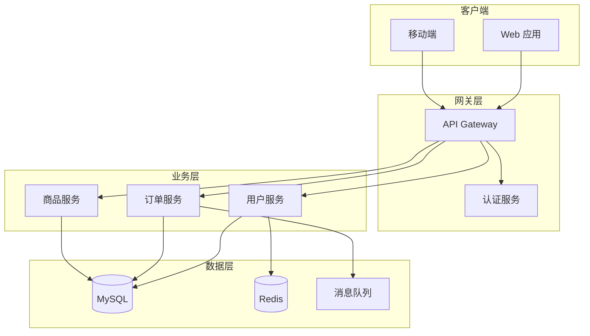

### 前端架构

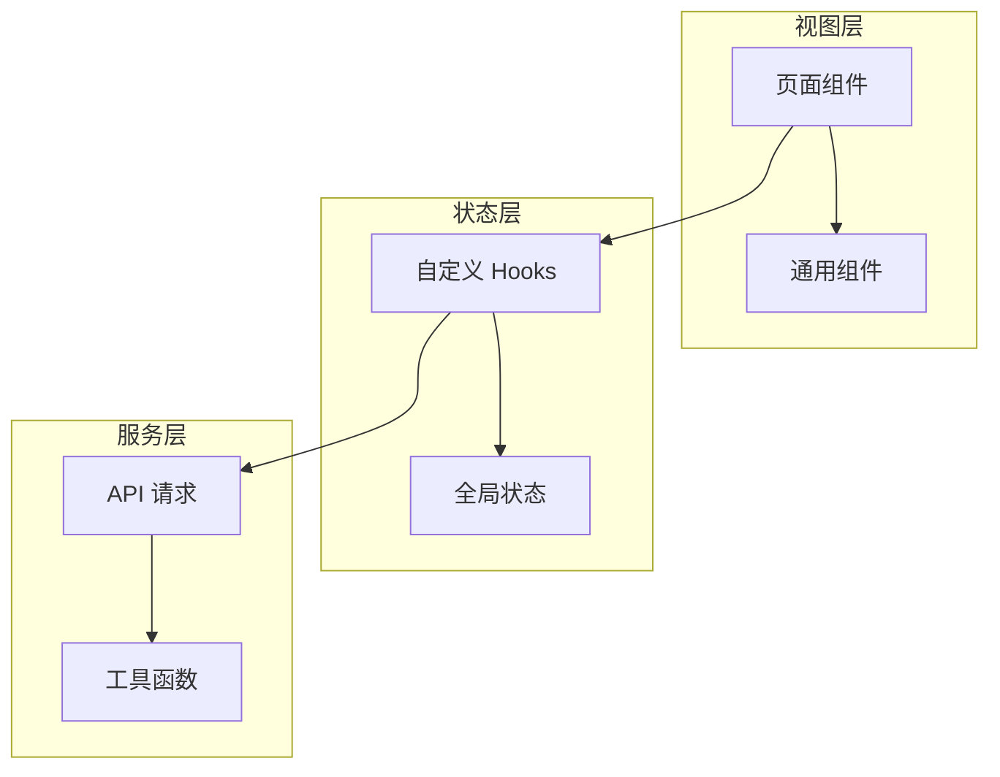

## 在 Markdown 中使用

````markdown
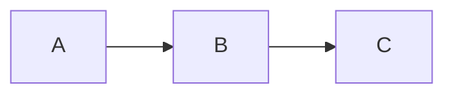
````

## 样式定制

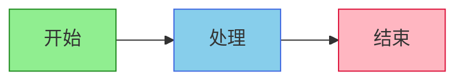

## 🔗 与其他 Skills 协作

| Skill | 协作方式 |
|-------|----------|
| `bpmn-workflow-patterns` | 流程图替代方案 |
| `drawio-diagrams` | 复杂图表补充 |

### 常用场景

- 技术文档中的架构图
- README 中的流程说明
- 代码注释中的逻辑图
- PR 描述中的变更说明
