# Mermaid 图表详细示例

> 📖 **本文件**: 包含 7 种图表类型的详细语法和项目实战示例
> **主文件**: [SKILL.md](./SKILL.md)

---

## 1. 流程图 (Flowchart)

**基础语法**
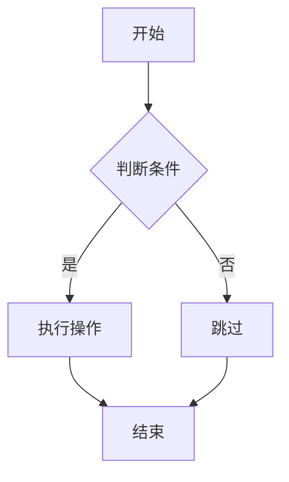

**方向选项**
- `graph TB` - 从上到下 (Top to Bottom)
- `graph TD` - 从上到下 (Top Down，同 TB)
- `graph LR` - 从左到右 (Left to Right)
- `graph RL` - 从右到左 (Right to Left)

**节点形状**
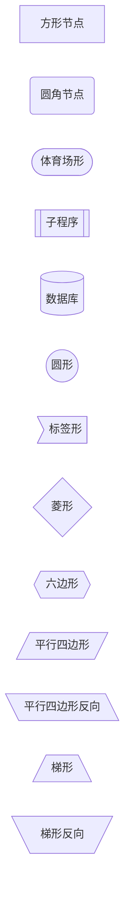

**连接线样式**
```mermaid
graph LR
    A --> B      %% 实线箭头
    C --- D      %% 实线
    E -.-> F     %% 虚线箭头
    G -.- H      %% 虚线
    I ==> J      %% 粗线箭头
    K === L      %% 粗线
    M -->|标签| N  %% 带标签箭头
```

**项目实战：React 组件渲染流程**
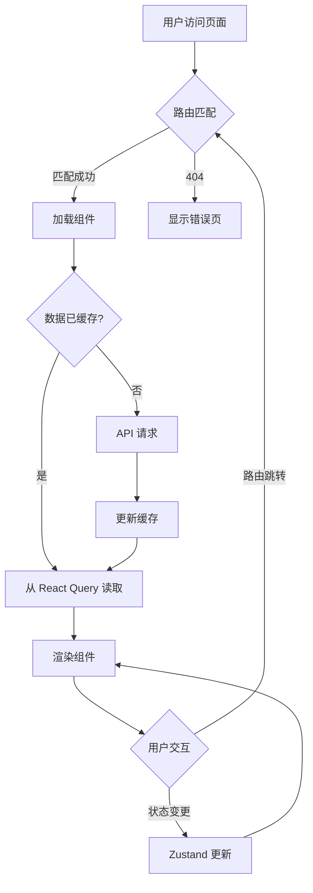

---

## 2. 序列图 (Sequence Diagram)

**基础语法**
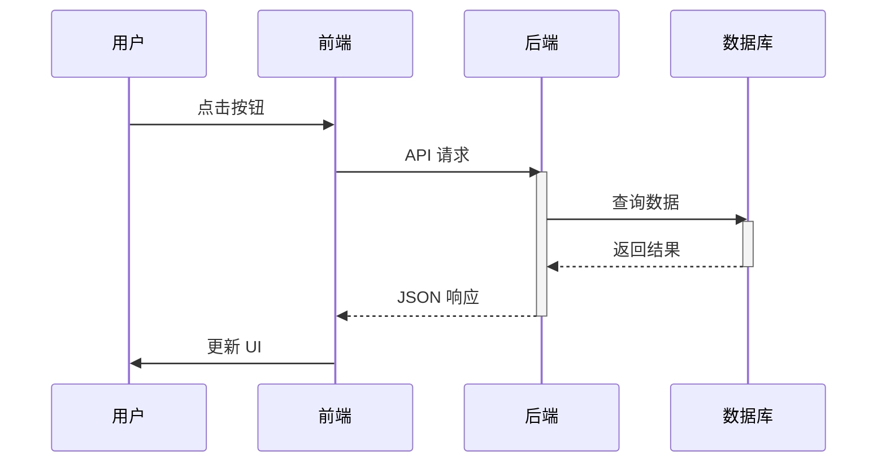

**高级特性**
```mermaid
sequenceDiagram
    autonumber  %% 自动编号
    actor U as 用户
    participant F as 前端
    participant B as 后端

    U->>+F: 登录请求
    Note over F: 验证表单
    F->>+B: POST /auth/login
    alt 成功
        B-->>F: {token, user}
        F->>F: 存储 token
        F-->>-U: 跳转主页
    else 失败
        B-->>F: {error}
        F-->>-U: 显示错误
    end

    par 并行操作
        F->>B: 获取用户信息
    and
        F->>B: 获取通知
    end

    loop 轮询
        F->>B: 检查新消息
        B-->>F: 消息列表
    end
```

**项目实战：SignalR 实时消息流程**
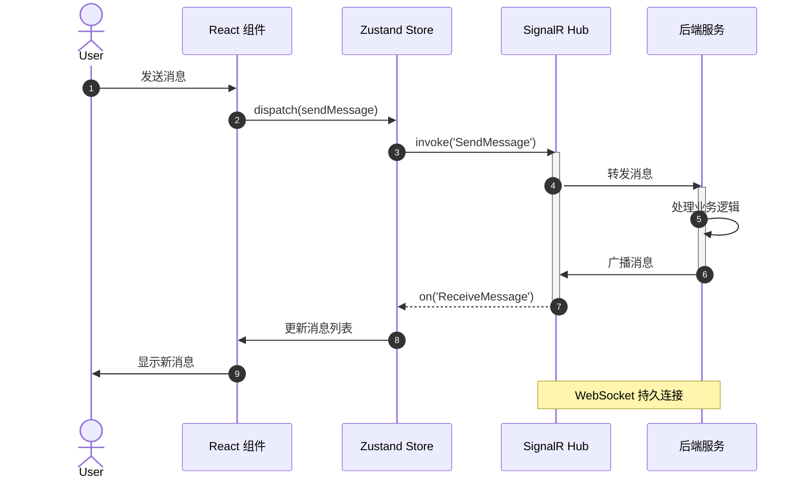

---

## 3. 类图 (Class Diagram)

**基础语法**
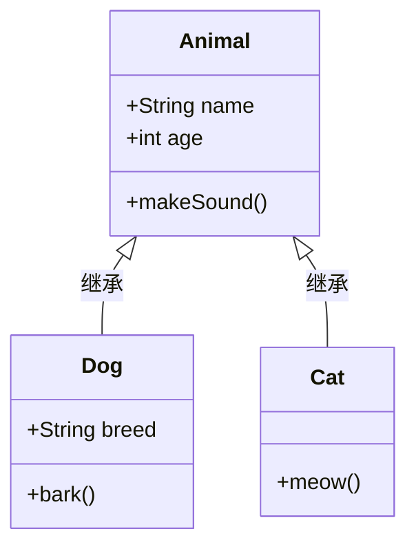

**关系类型**
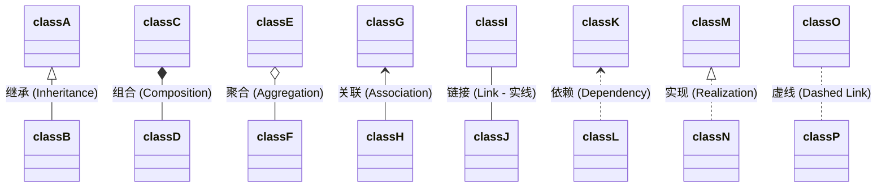

**项目实战：Zustand Store 架构**
```mermaid
classDiagram
    class BaseStore {
        <<interface>>
        +state: State
        +actions: Actions
    }

    class WorkflowStore {
        +nodes: Node[]
        +edges: Edge[]
        +addNode(node)
        +updateNode(id, data)
        +deleteNode(id)
    }

    class DifyStore {
        +conversations: Map
        +currentConversationId: string
        +createConversation()
        +addMessage()
    }

    class AuthStore {
        +user: User | null
        +token: string
        +login(credentials)
        +logout()
    }

    BaseStore <|.. WorkflowStore : implements
    BaseStore <|.. DifyStore : implements
    BaseStore <|.. AuthStore : implements

    WorkflowStore --> Node : uses
    WorkflowStore --> Edge : uses
    DifyStore --> Conversation : contains
```

---

## 4. 状态图 (State Diagram)

**基础语法**
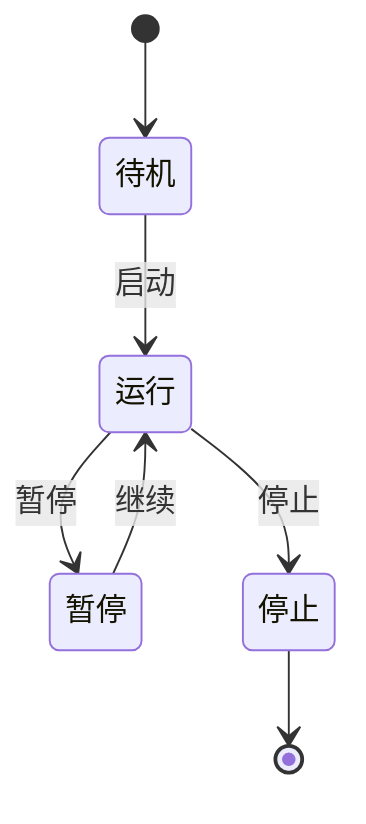

**复合状态**
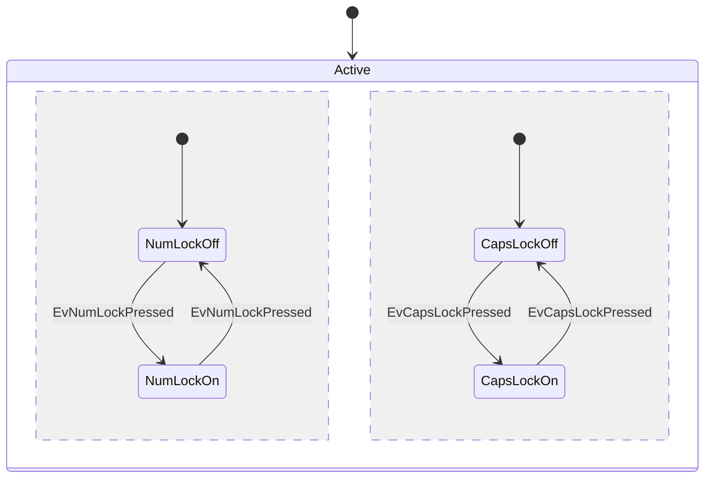

**项目实战：Workflow 执行状态**
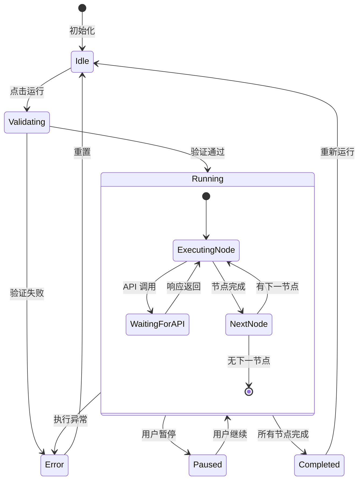

---

## 5. ER 图 (Entity Relationship Diagram)

**基础语法**
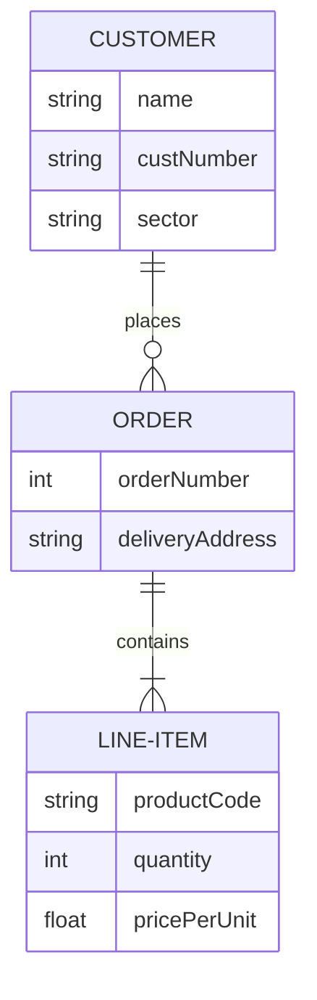

**关系类型**
- `||--||` : 一对一 (One to One)
- `||--o{` : 一对多 (One to Many)
- `}o--o{` : 多对多 (Many to Many)

**项目实战：数据库模型**
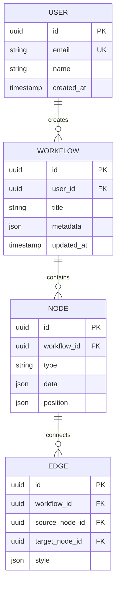

---

## 6. 甘特图 (Gantt Chart)

**基础语法**
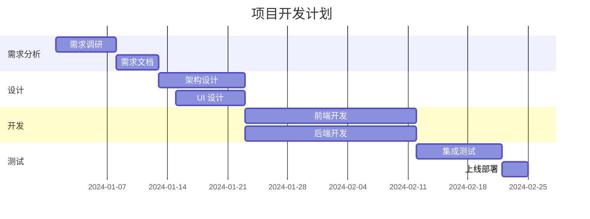

**项目实战：Sprint 计划**
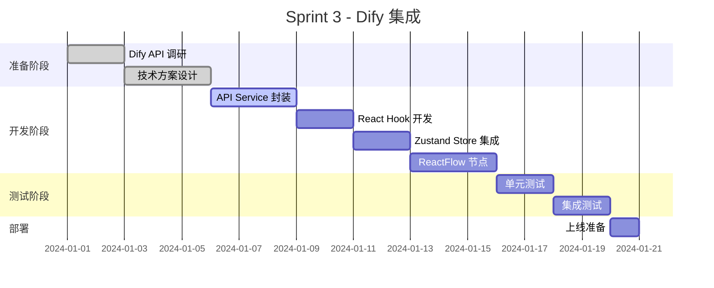

---

## 7. 用户旅程图 (User Journey)

**基础语法**
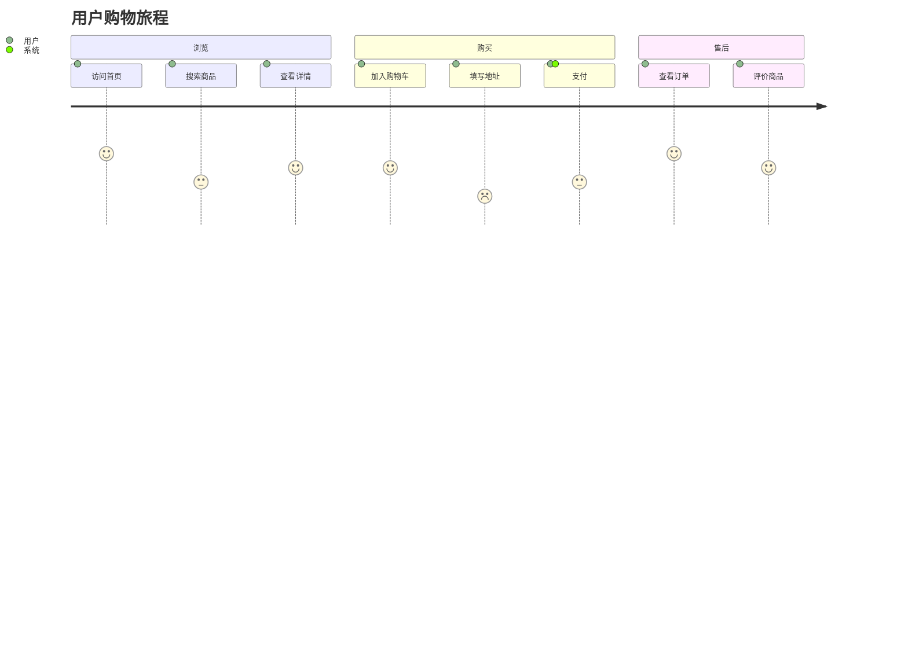

**项目实战：Workflow 编辑旅程**
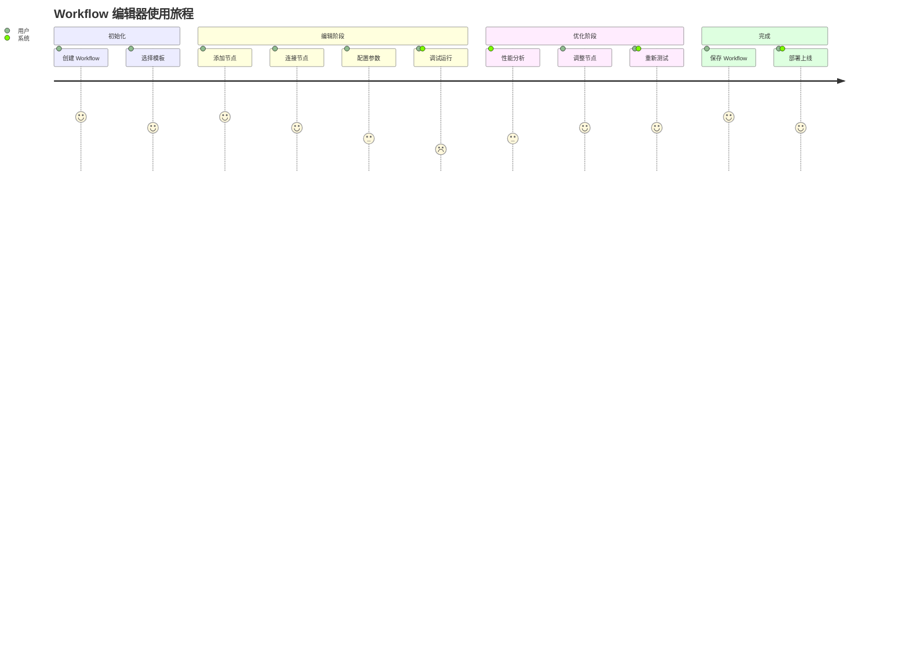

---

## 高级技巧

### 1. 主题定制

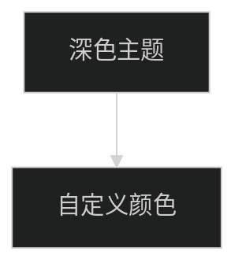

**可用主题**
- `default` - 默认主题
- `dark` - 深色主题
- `forest` - 森林主题
- `neutral` - 中性主题

### 2. 子图 (Subgraph)

```mermaid
graph TB
    subgraph 前端层
        A[React 组件]
        B[Zustand Store]
    end
    subgraph 数据层
        C[React Query]
        D[IndexedDB]
    end
    subgraph 后端层
        E[API Gateway]
        F[业务服务]
    end

    A --> B
    B --> C
    C --> E
    E --> F
    C --> D
```

### 3. 样式定制

```mermaid
graph LR
    A[节点 A]:::classA --> B[节点 B]:::classB
    B --> C[节点 C]:::classC

    classDef classA fill:#f9f,stroke:#333,stroke-width:4px
    classDef classB fill:#bbf,stroke:#f66,stroke-width:2px,stroke-dasharray: 5 5
    classDef classC fill:#ff6,stroke:#333,stroke-width:2px
```

---

## 与项目集成

### 1. Markdown 文档中使用

```markdown
## 系统架构

\`\`\`mermaid
graph TD
    A[用户] --> B[React App]
    B --> C[API]
\`\`\`
```

### 2. React 组件渲染

```typescript
// 使用 react-mermaid 库
import { Mermaid } from 'react-mermaid';

function FlowchartViewer() {
  const chart = `
    graph TD
      A[开始] --> B[处理]
      B --> C[结束]
  `;

  return <Mermaid chart={chart} />;
}
```

### 3. 动态生成图表

```typescript
function generateWorkflowDiagram(nodes: Node[], edges: Edge[]): string {
  let mermaid = 'graph TD\n';

  nodes.forEach(node => {
    mermaid += `  ${node.id}[${node.data.label}]\n`;
  });

  edges.forEach(edge => {
    mermaid += `  ${edge.source} --> ${edge.target}\n`;
  });

  return mermaid;
}
```

---

## 快速参考

| 图表类型 | 关键字 | 用途 |
|---------|--------|------|
| 流程图 | `graph` | 流程、决策、系统架构 |
| 序列图 | `sequenceDiagram` | 时序交互、API 调用 |
| 类图 | `classDiagram` | 类结构、对象关系 |
| 状态图 | `stateDiagram-v2` | 状态转换、生命周期 |
| ER 图 | `erDiagram` | 数据库设计、实体关系 |
| 甘特图 | `gantt` | 项目计划、时间线 |
| 旅程图 | `journey` | 用户体验、流程分析 |
