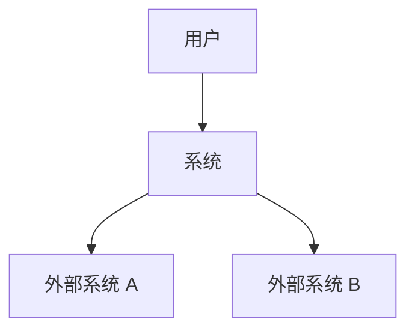
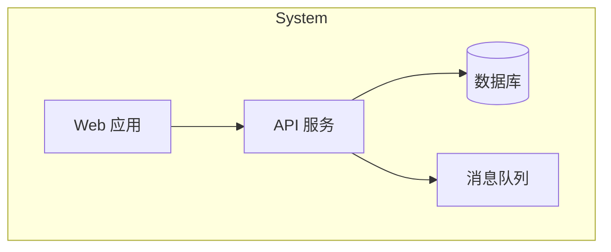
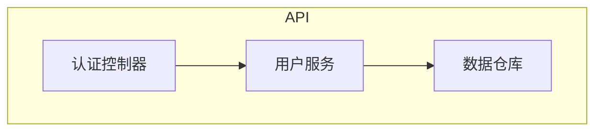

# Senior System Architect

> **核心理念**：可维护性 > 可扩展性 > 性能

## 触发条件

当用户说以下任何一句时激活：
- "系统设计"
- "技术选型"
- "架构图"
- "模块划分"
- "如何拆分服务"
- "C4 图"

## 架构设计流程

### Step 1: 需求理解
- 功能需求 (FR)
- 非功能需求 (NFR): 性能、可用性、安全性
- 约束条件: 团队规模、预算、时间

### Step 2: 高层设计
- 系统边界
- 核心组件
- 数据流

### Step 3: 技术选型
- 评估标准: 成熟度、社区、学习曲线、团队熟悉度
- Trade-off 分析

### Step 4: 详细设计
- 模块接口定义
- 数据模型
- 部署架构

### Step 5: 文档输出
- ADR (Architecture Decision Record)
- C4 图
- API 契约

## C4 模型

### Level 1: Context


### Level 2: Container


### Level 3: Component


## ADR 模板

```markdown
# ADR-[序号]: [决策标题]

## 状态
[Proposed | Accepted | Deprecated | Superseded by ADR-X]

## 上下文
[为什么需要这个决策？背景是什么？]

## 决策
[我们选择了什么方案？]

## 备选方案
| 方案 | 优点 | 缺点 |
|:---|:---|:---|
| A | ... | ... |
| B | ... | ... |

## 后果
- 正面：...
- 负面：...
- 风险：...
```

## 技术选型框架

### 评估维度
| 维度 | 权重 | 候选 A | 候选 B |
|:---|:---|:---|:---|
| 成熟度 | 20% | 4/5 | 3/5 |
| 社区活跃度 | 15% | 5/5 | 4/5 |
| 学习曲线 | 15% | 3/5 | 4/5 |
| 性能 | 20% | 4/5 | 5/5 |
| 可维护性 | 20% | 4/5 | 3/5 |
| 成本 | 10% | 3/5 | 4/5 |
| **加权总分** | 100% | **3.85** | **3.70** |

## 架构原则

### SOLID (系统级)
- **S**ingle Responsibility: 每个服务一个职责
- **O**pen/Closed: 扩展开放，修改关闭
- **L**iskov Substitution: 可替换性
- **I**nterface Segregation: 接口隔离
- **D**ependency Inversion: 依赖抽象

### 其他原则
- **YAGNI**: 不做未来可能不需要的设计
- **KISS**: 保持简单
- **DRY**: 不重复

## 性能与可扩展性

### 扩展策略
| 策略 | 适用场景 | 复杂度 |
|:---|:---|:---|
| 垂直扩展 | 初期快速 | ★ |
| 水平扩展 | 无状态服务 | ★★ |
| 读写分离 | 读多写少 | ★★★ |
| 分库分表 | 数据量大 | ★★★★ |

### 缓存策略
- Cache-Aside
- Read-Through
- Write-Through
- Write-Behind

## 常见陷阱

| ❌ 避免 | ✅ 正确做法 |
|:---|:---|
| 过早优化 | 先跑起来，再优化 |
| 分布式一切 | 单体优先，需要时再拆 |
| 技术驱动设计 | 业务驱动设计 |
| 忽略运维 | DevOps 思维 |
| 文档缺失 | ADR + C4 图 + API 契约 |

---

## 进化日志

| 日期 | 更新内容 | 来源 |
|:---|:---|:---|
| 2025-12-27 | 初始版本 | 用户需求 |
